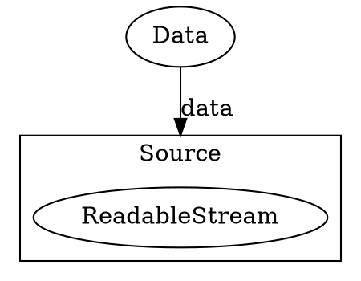
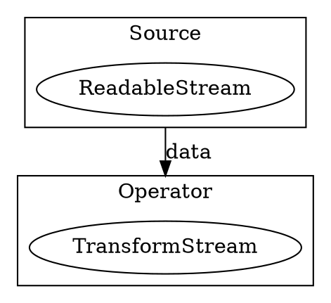
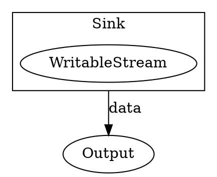
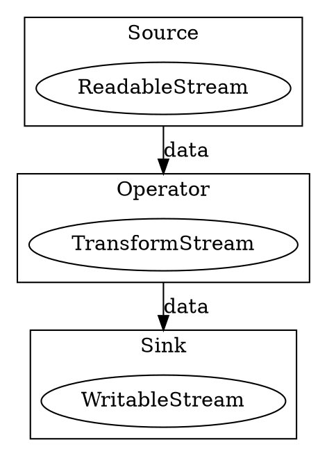
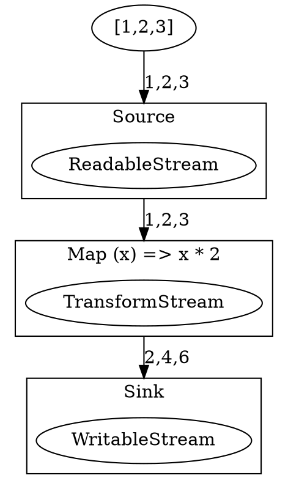
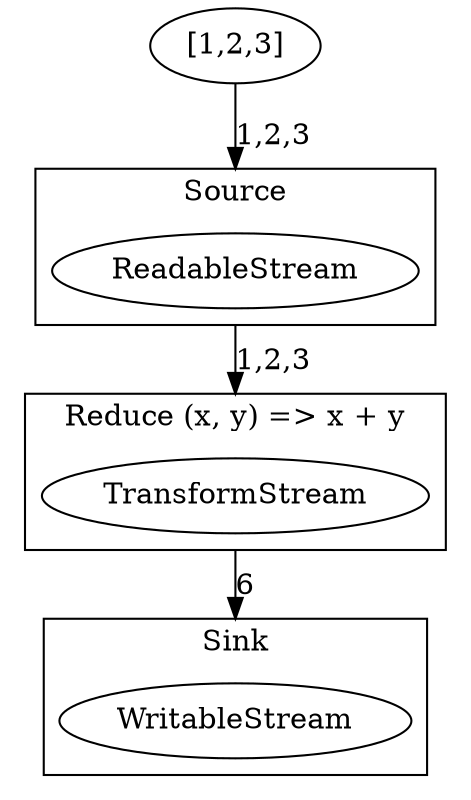
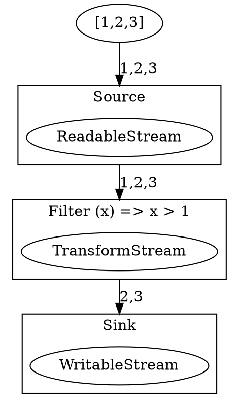
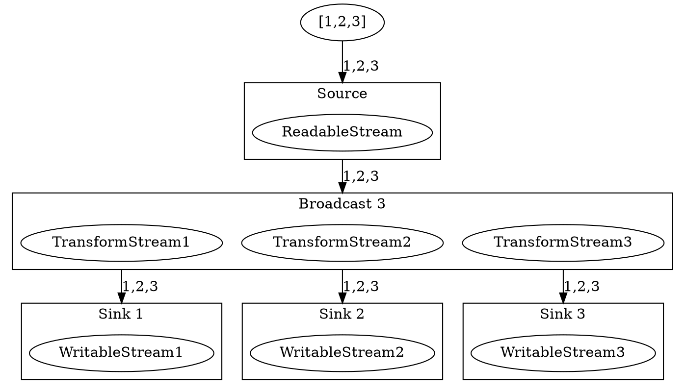
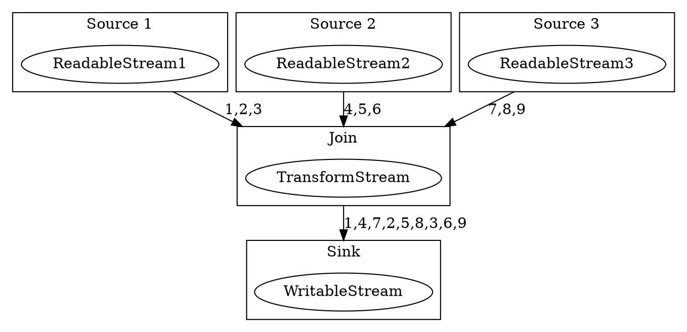

# StreamWeave

StreamWeave is a toolkit centered around the use of Streams for building general
purpose computer programs.

It uses the Web Streams API to provide a unified interface for handling data
streams, enabling developers to build robust and scalable applications with
ease. StreamWeave's core principles revolve around the following key concepts:

1. **Stream Composition**: StreamWeave embraces the power of streams by
   providing a set of composable building blocks that can be combined to create
   complex data processing pipelines.
2. **Stream Reactivity**: Streams are inherently reactive, meaning that data can
   be processed in real-time as it arrives.
3. **Stream Backpressure**: StreamWeave ensures that data flows are managed
   efficiently, preventing overload or slowdown due to backpressure.
4. **Stream Error Handling**: Streams can handle errors gracefully, ensuring
   uninterrupted data flow and recovery from failures.  5. **Stream
   Parallelism**: StreamWeave supports parallel processing of streams, allowing
   for efficient utilization of multiple resources.
5. **Stream Integration**: StreamWeave integrates seamlessly with other Web
   technologies, such as Web Workers and WebAssembly, enabling the creation of
   powerful and efficient applications.
6. **Stream Interoperability**: StreamWeave is designed to work with a wide
   range of data sources and destinations, making it suitable for a variety of
   use cases.

## Basics

### Source

A Source is an interface that connect a data source to a stream. It defines the
methods and properties that are required to read data from the source and emit
it to the stream. A Source returns a ReadableStream.

### Operator

An Operator is a component that transforms or processes data in a stream. It
defines the methods and properties that are required to perform the
transformation or processing. An Operator takes a Source or another Operator as
an input and it returns a TransformStream.

### Sink

A Sink is a component that consumes data from a stream. It defines the methods
and properties that are required to read data from the stream and write it to a
destination. A Sink returns a WritableStream.

### Pipeline

Naturally, these three components can be combined to create a pipeline.

## Transforming Data

### Map

Mapping is a simple transformation that applies a function to each element of a
stream. It is a fundamental building block for transforming data in a stream.

### Reduce

Reducing is a transformation that accumulates the elements of a stream into a
single result. It is useful for calculating aggregated metrics or summarizing
information from a stream.

### Filter

Filtering is a transformation that allows only elements that meet a certain
condition to pass through the stream. It is useful for refining data flows,
ensuring that only relevant data reaches downstream operations.

### Split

Splitting is a transformation that divides a stream into multiple outputs. It is
useful for broadcasting data or applying different processing logic to the same
input source. You can apply different kinds of logic to divide or duplicate the
incoming data to the output streams. These can be implemented in different
components like Broadcast or RoundRobin.

### Merge

Merging is a transformation that combines multiple streams into a single output
stream. It is useful for combining data from different sources or synchronizing
data streams. Like Split, you can apply different kinds of logic to merge or
combine the incoming data to the output stream. These can be implemented in
different components like Join or Concat.

## Parallelism

Streams in JavaScript are inherently parallel due to the asynchronous nature of
the JavaScript runtime. This characteristic allows data processing tasks to run
concurrently without blocking the main execution thread. By leveraging
asynchronous I/O, streams can efficiently handle large volumes of data across
multiple operations in parallel.

### Inherent Parallelization

The streaming paradigm allows developers to naturally take advantage of
JavaScript's event-driven model, enabling parallel processing of data streams as
they arrive. Each component in a streaming pipeline (i.e., Source, Operator,
Sink) processes data in its own execution context, allowing multiple operations
to occur simultaneously. This results in faster data processing and improved
performance, especially in I/O-bound applications.

### Encapsulating Parallelization Techniques

While streams provide a level of parallelism by their own design, additional
parallelization techniques can be implemented to enhance performance further:

- **Web Workers**: By offloading heavy computations to Web Workers, developers
  can leverage multi-core CPU capabilities. Web Workers operate in separate
  threads, allowing tasks to run in parallel to the main thread. This helps in
  reducing the load on the main thread, providing smoother performance for
  critical tasks like UI rendering.

- **Node.js Cluster**: In Node.js environments, the Cluster module can be used
  to create child processes that share the same server port. These cluster
  processes can handle separate incoming requests, making better use of
  multi-core systems. This approach can be particularly beneficial for
  CPU-intensive tasks, allowing them to be spread across multiple processors.

By integrating these parallelization strategies with the inherent parallel
nature of streams, StreamWeave can provide robust support for efficient and
scalable data processing applications.

By implementing these techniques as Composition instead of Parameterization or
Runtime, we can achieve a more flexible and modular approach to parallelization,
allowing developers to tailor the parallelization strategy to their specific
needs. This also increases maintainability and reusability of the codebase of
StreamWeave itself, as it can be implemented as a library of components.

## Integration with Other Technologies

StreamWeave can be integrated with other technologies to enhance its
functionality and performance. Some examples include:

- **WebSockets**: StreamWeave can be used to create WebSocket-based data
  processing pipelines, allowing real-time data exchange between clients and
  servers. This integration can be particularly useful for applications that
  require real-time updates, such as chat applications or live streaming.
- **WebRTC**: StreamWeave can be used to create WebRTC-based data processing
  pipelines, enabling real-time communication between peers. This integration
  can be useful for applications that require real-time collaboration, such as
  video conferencing or live streaming.
- **WebAssembly**: StreamWeave can be used to create WebAssembly-based data
  processing pipelines, allowing for efficient and scalable data processing in
  the browser. This integration can be particularly useful for applications that
  require high-performance computing, such as machine learning or scientific
  simulations.

## Components

Inspiration was taken from [NoFlo](https://noflojs.org/) for the components.

### Source Components

#### Kick

Generates a single item and pushes it to the stream.

#### Timeout

Generates an item after a specified delay and pushes it to the stream.

#### Interval

Generates an item at a specified interval and pushes it to the stream.

#### EnvironmentVariable

Reads an environment variable and pushes its value to the stream.

#### GlobalVariable

Reads a global variable and pushes its value to the stream.

#### String

Creates a string.

#### Number

Creates a number.

#### Boolean

Creates a boolean.

#### Object

Creates an object.

#### Array

Creates an array.

#### Date

Creates a Date object.

#### Timestamp

Creates a timestamp.

#### Error

Creates an Error object.

#### Function

Creates a Function.

### Operator Components

#### Repeat

Outputs all items in the input stream to the output stream.

#### Delay

Delays each item in the stream by a specified amount of time.

#### Throttle

Throttles the output stream to a specified rate.

#### ExtendedObject

Extends an object with additional properties.

#### FilteredObject

Filters an object based on a predicate function.

#### FlattenedObject

Flattens an object of objects into a single object.

#### ValueFromObject

Gets a value from an object.

#### KeysFromObject

Gets an array of keys from an object.

#### ValuesFromObject

Gets an array of values from an object.

#### SizeOfObject

Gets the size of an object.

#### ConcatenatedArray

Concatenate each Array in the stream with an array.

#### ValueFromArray

Gets a value from an array.

#### FlattenedArray

Flattens an array of arrays into a single array.

#### SizeOfArray

Gets the size of an array.

#### ErrorFromString

Creates an Error object from a string.

#### StringFromError

Creates a string from an Error object.

#### DateFromTimestamp

Creates a Date object from a timestamp.

#### DateFromString

Creates a Date object from a string.

#### TimestampFromDate

Creates a timestamp from a Date object.

#### StringFromDate

Creates a string from a Date object.

### Sink Components

#### Drop

Drops each item in the stream.

#### Callback

Calls a Callback for each data item in the stream.

#### ObjectFunction

Calls a Function on an Object for each data item in the stream.

#### Log

Logs each item in the stream using the console.
